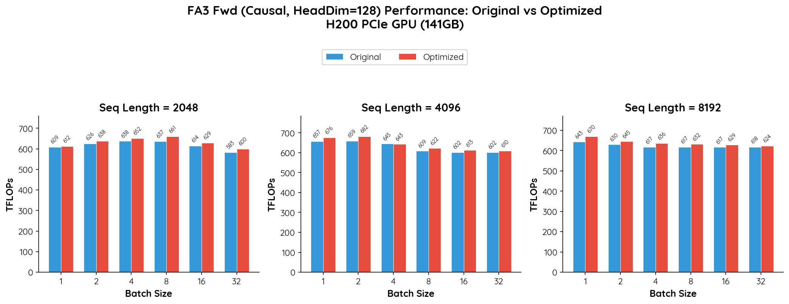

# Agentic FlashAttention-3 Optimization

This guide walks you through setting up FlashAttention-3 and using the G-Watch agent to automatically optimize its CUDA kernels.

## 0. Clone G-Watch

Start by cloning the G-Watch repository and navigating into it:

```bash
git clone https://github.com/mars-compute-ai/G-Watch.git
cd G-Watch
export REPO_PATH=$PWD
```

All subsequent commands assume you are running from the G-Watch root directory.

## 1. Install Prerequisites

Install the required Python packages:

```bash
pip3 install packaging torch torchvision
```

## 2. Clone and Build FlashAttention-3

Clone the FlashAttention repository and check out the known-good commit that this example is tested against:

```bash
git clone --recursive https://github.com/Dao-AILab/flash-attention.git
cd flash-attention
git checkout d146efff6f3226f465f1b4f089eaefe52c475e9c
```

Next, apply the patch that integrates PTX instrumentation into the FA-3 build:

```bash
git apply $REPO_PATH/examples/cuda/fa3/fa3_build_with_ptx.patch
```

Now build FA-3. The environment variables below narrow the build scope to keep compilation fast — only the forward-pass kernel with hdim128, FP16, on Hopper is compiled:

```bash
cd hopper/
export FLASH_ATTENTION_DISABLE_HDIM64="TRUE"
export FLASH_ATTENTION_DISABLE_HDIM96="TRUE"
export FLASH_ATTENTION_DISABLE_HDIM192="TRUE"
export FLASH_ATTENTION_DISABLE_HDIM256="TRUE"
export FLASH_ATTENTION_DISABLE_BACKWARD="TRUE"
export FLASH_ATTENTION_DISABLE_FP8="TRUE"
export FLASH_ATTENTION_DISABLE_SM80="TRUE"
python3 setup.py install
```

## 3. Verify the Installation

Once the build completes, run the FLOPS benchmark to confirm FA-3 is installed and produces valid results:

```bash
cd $REPO_PATH/examples/cuda/fa3
python3 do_flops_fa3.py
```

## 4. Start the Agent Loop

Everything is set up.
Launch the optimization agent by invoking the `gwatch-cuda-optimize-fa3` skill inside your code agent.
This skill is automatically installed to your code agent when you install G-Watch.

```bash
─── Claude Code v2.1.63 ─────────────────────────────╮
│                                                    │ 
│                Welcome back Mars-Compute!          │
│                                                    │
│                                                    │
│                       ▐▛███▜▌                      │
│                      ▝▜█████▛▘                     │
│                        ▘▘ ▝▝                       │
│   Opus 4.6 · Claude Max · demo@mars-compute.com's  │
│   Organization                                     │
│                       /root                        │
╰────────────────────────────────────────────────────╯
─────────────────────────────────
❯ /gwatch-cuda-optimize-fa3
❯ FA_PATH is @[THE PATH TO flash-attention]
─────────────────────────────────
```

## 5. Results

We ran the agent through this workflow multiple times and it successfully optimized the FA-3 kernel:

<div align="center">
    
</div>
